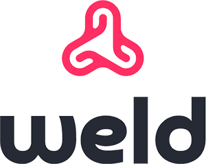

<div align="center">
  
  <h3 align="center">Weld</h3>
  <p align="center">The last wallet connector you will need</p>
</div>

## Structure

```
weld/
├── core/              # @ada-anvil/weld — universal wallet connector     
├── packages/
│   ├── biome/         # @weld/biome — shared biome config
│   ├── tsconfig/      # @weld/tsconfig — shared TypeScript config
│   └── utils/         # @weld/utils — shared utils
├── plugins/
│   └── hodei/         # @ada-anvil/hodei-client — Hodei wallet plugin
└── apps/
    └── playground/          # local dev & examples app
```

## Packages

| Package | Description |
|---|---|
| [`@ada-anvil/weld`](./core) | Core library — wallet connections across Cardano, Ethereum, Polygon, Solana and Bitcoin |
| [`@ada-anvil/hodei-client`](./plugins/hodei) | Plugin adding Hodei wallet support |

## Getting Started

Requires Node.js and npm.

```bash
npm install
npm run build
```

## Development

```bash
npm run dev      # watch mode across all packages
npm run lint     # lint all packages
npm run test     # test all packages
```

## Contributing

See [CONTRIBUTING.md](./CONTRIBUTING.md).